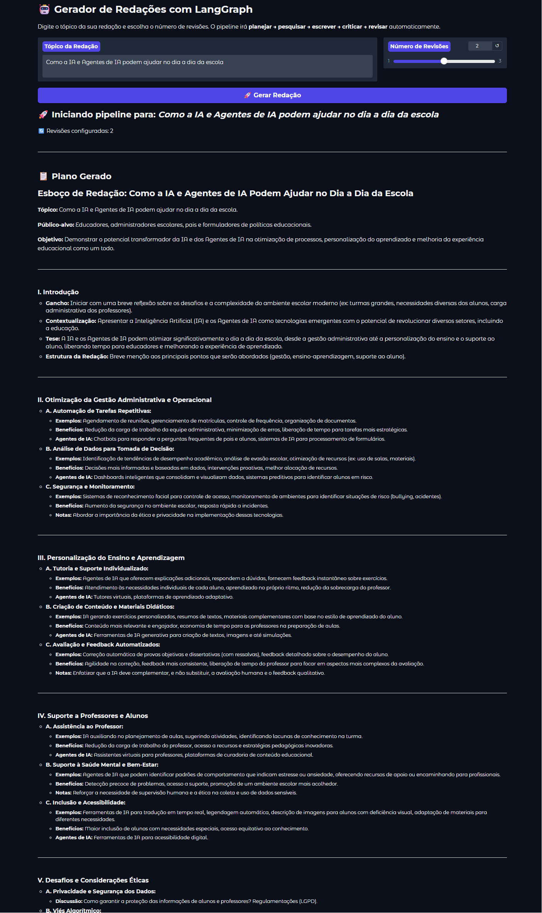
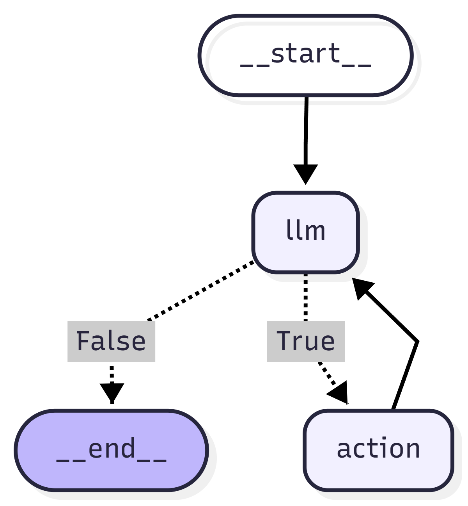

# 🤖 LangGraph Agents

Projeto de estudo e portfólio desenvolvido durante o curso **LangGraph: Orquestrando agentes e multiagentes** da Alura, parte da trilha **Engenharia de Agentes de IA**.

Demonstra a evolução da construção de agentes de IA — desde a implementação manual do padrão **ReAct** até a orquestração de múltiplos agentes com **LangGraph**, com interface web via **Gradio**.

---

## 🖥️ Interface



---

## 🧠 O que foi construído

### Agente 1 — ReAct Manual (Inventário)
Implementação do padrão **ReAct (Reasoning + Acting)** do zero, sem frameworks de orquestração. Um assistente de inventário para uma loja de informática com 4 ferramentas:

| Ferramenta | Descrição |
|---|---|
| `consultar_estoque` | Retorna a quantidade disponível de um item |
| `consultar_preco_produto` | Retorna o preço unitário de um produto |
| `encontrar_produto_mais_caro` | Retorna o produto de maior valor |
| `calcular_valor_total_lista` | Calcula o total de uma lista de itens |

### Agente 2 — LangGraph + Tavily (Pesquisa Web)
Agente de pesquisa geral com busca em tempo real. Suporta:
- Chamadas **simples** (uma busca)
- Chamadas **paralelas** (múltiplas buscas simultâneas)
- Chamadas **sequenciais** (buscas dependentes entre si)

### Agente 3 — Persistência e Streaming
Agente com **memória entre conversas** usando SQLite como checkpointer. Cada `thread_id` mantém um contexto independente e persistente.

### Agente 4 — Human in the Loop (HITL)
Agente com **aprovação humana** antes de executar ações, e suporte a **injeção manual de respostas** no estado do grafo.

### Agente 5 — Pipeline Multiagentes
Pipeline completo com **5 agentes especializados** orquestrando a criação de conteúdo de nível profissional:

| Agente | Responsabilidade |
|---|---|
| **Planejador** | Cria esboço estruturado do tema |
| **Pesquisador** | Busca fontes no Tavily |
| **Escritor** | Escreve o ensaio |
| **Crítico** | Analisa e recomenda melhorias |
| **Pesquisador de Revisão** | Busca mais fontes com base na crítica |

---

## 🗺️ Arquitetura do Pipeline Multiagentes

```
__start__ → planner → research_plan → generate
                                          ↓
                                    should_continue?
                                    ↙           ↘
                                  END          reflect
                                                 ↓
                                        research_critique
                                                 ↓
                                              generate
```



---

## 🛠️ Tecnologias

- **Python 3.12**
- **LangGraph** — orquestração de agentes em grafo
- **LangChain** — integração com LLMs e ferramentas
- **OpenRouter** — acesso ao Gemini 2.5 Flash via API compatível com OpenAI
- **Tavily** — busca web em tempo real para agentes de IA
- **SQLite** — persistência de estado entre conversas
- **Gradio** — interface web interativa
- **BeautifulSoup + Selenium** — web scraping
- **python-dotenv** — gerenciamento de variáveis de ambiente

---

## 📁 Estrutura do Projeto

```
langgraph-agents/
│
├── .env.example
├── .gitignore
├── README.md
├── requirements.txt
├── docs/
│   ├── grafo_agente.png
│   └── gradio_interface.png
│
└── src/
    ├── app.py                  # Interface Gradio
    ├── new_backend.py          # Backend consolidado para o Gradio
    ├── main.py                 # Ponto de entrada para testes
    ├── agents/
    │   ├── react_agent.py      # Agente ReAct manual
    │   ├── langgraph_agent.py  # Agente LangGraph básico
    │   ├── persistent_agent.py # Agente com memória SQLite
    │   └── hitl_agent.py       # Agente com Human in the Loop
    ├── config/
    │   └── settings.py
    ├── multiagents/
    │   ├── state.py            # AgentState do pipeline
    │   ├── prompts.py          # Prompts dos 5 agentes
    │   ├── nodes.py            # Funções de cada nó
    │   └── graph.py            # Montagem do grafo
    ├── prompts/
    ├── state/
    └── tools/
        ├── inventario.py
        ├── busca.py
        └── scraping.py
```

---

## 🚀 Como rodar

### Pré-requisitos
- Python 3.12+
- Conta no [OpenRouter](https://openrouter.ai/) com saldo
- Conta no [Tavily](https://tavily.com/) para a chave de busca

### 1. Clone o repositório
```bash
git clone https://github.com/jjsjunior3/langgraph-agents.git
cd langgraph-agents
```

### 2. Crie e ative o ambiente virtual
```bash
py -m venv .venv
.venv\Scripts\activate  # Windows
```

### 3. Instale as dependências
```bash
pip install -r requirements.txt
```

### 4. Configure as variáveis de ambiente
```bash
cp .env.example .env
```
Edite o `.env`:
```env
OPENROUTER_API_KEY=sk-or-v1-sua_chave_aqui
TAVILY_API_KEY=tvly-dev-sua_chave_aqui
```

### 5. Execute a interface Gradio
```bash
cd src
py app.py
```
Acesse `http://127.0.0.1:7860` no navegador.

### 6. Ou execute os testes em terminal
```bash
py src/main.py
```

---

## 💡 Conceitos demonstrados

- Padrão **ReAct** implementado manualmente
- **StateGraph** com nós, arestas e arestas condicionais
- **bind_tools** para registro nativo de ferramentas
- **Streaming** vs **Invoke**
- Chamadas de ferramentas **paralelas** e **sequenciais**
- **Persistência** de estado com SQLite e thread_id
- **Human in the Loop** com interrupt_before e injeção de estado
- **Pipeline multiagentes** com loop controlado por revisões
- **Interface web** com Gradio e streaming em tempo real
- Boas práticas: `.env`, `.gitignore`, estrutura modular, ambiente virtual

---

## 📚 Referências

- [Curso Alura — LangGraph: Orquestrando agentes e multiagentes](https://cursos.alura.com.br/)
- [Documentação LangGraph](https://langchain-ai.github.io/langgraph/)
- [ReAct: Synergizing Reasoning and Acting in Language Models](https://arxiv.org/abs/2210.03629)
- [OpenRouter](https://openrouter.ai/)
- [Tavily](https://tavily.com/)

---

> Desenvolvido por **José João Santos Júnior** como projeto de portfólio durante os estudos de Engenharia de Agentes de IA.
>
> LinkedIn: [linkedin.com/in/jrsantosdev1](https://linkedin.com/in/jrsantosdev1) | GitHub: [github.com/jjsjunior3](https://github.com/jjsjunior3)